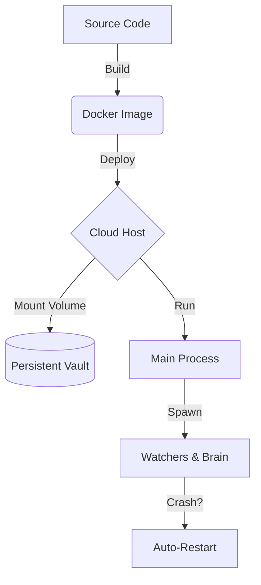

# Deployment Guide
> **How to keep your Agent alive 24/7/365.**

## 📦 Container Lifecycle



## Option A: Docker Compose (Recommended)
This is the easiest way to run the agent in a production container.

1.  **Start:**
    ```bash
    docker-compose up -d
    ```
2.  **View Logs:**
    ```bash
    docker-compose logs -f
    ```
3.  **Stop:**
    ```bash
    docker-compose down
    ```

## Option B: PM2 (Recommended for Bare Metal/Linux)
This method runs the agent as a background service on your OS.

1.  **Install PM2:**
    ```bash
    npm install -g pm2
    ```
2.  **Start:**
    ```bash
    pm2 start deployment/ecosystem.config.js
    ```
3.  **Persist (Run on Boot):**
    ```bash
    pm2 startup
    pm2 save
    ```
