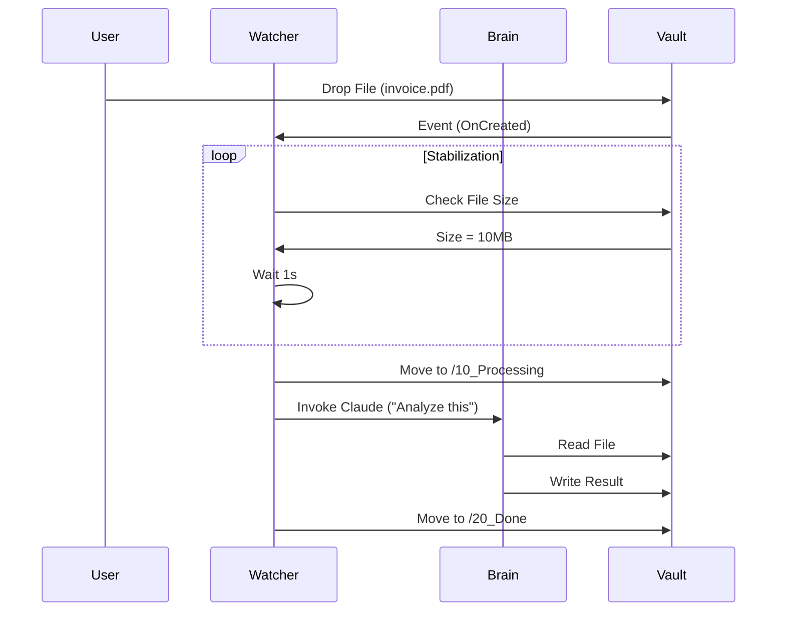

# Bronze Tier: The Foundation
> **Perception & Reasoning.**

This module implements the core "Loop": See File -> Think -> Act.

## 🔄 The Logic Loop



## Components
*   **`filesystem.py`**: A robust file watcher with upload stabilization.
*   **`claude_client.py`**: The interface to the Brain.

## Running Tests
```bash
uv run pytest tier_1_bronze/tests
```