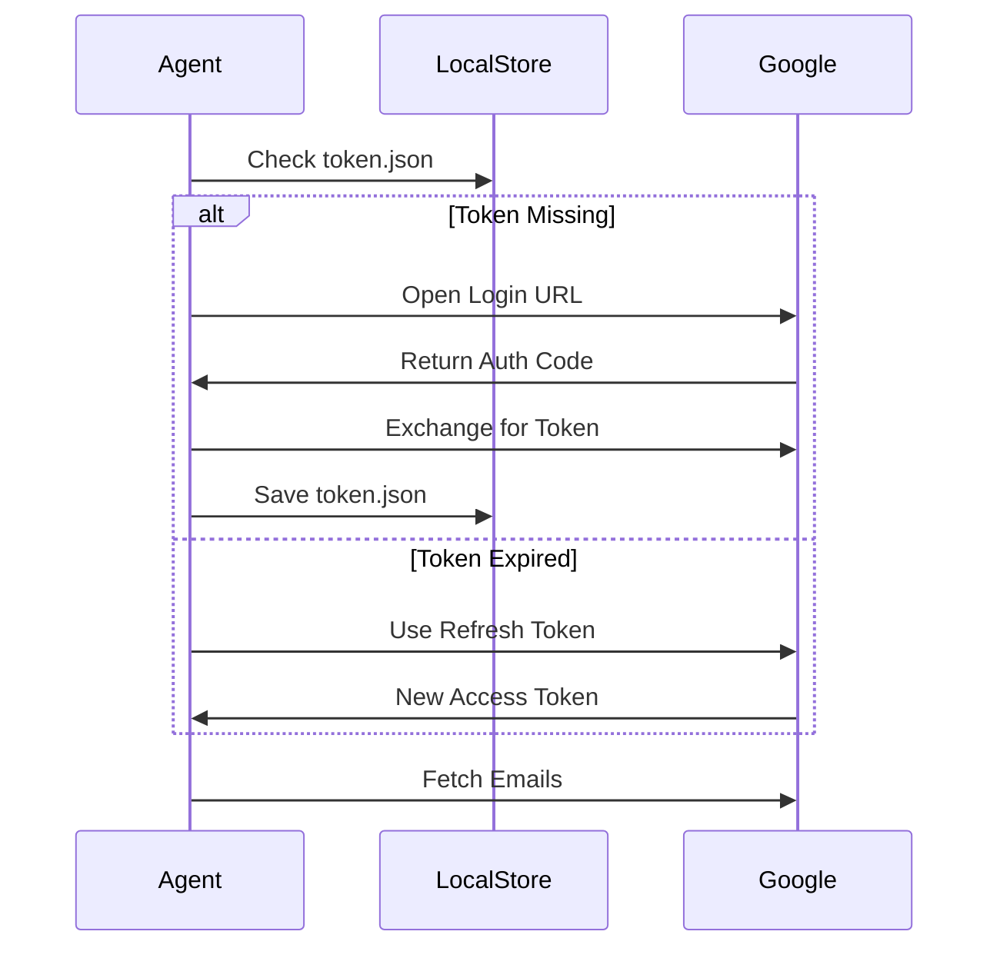
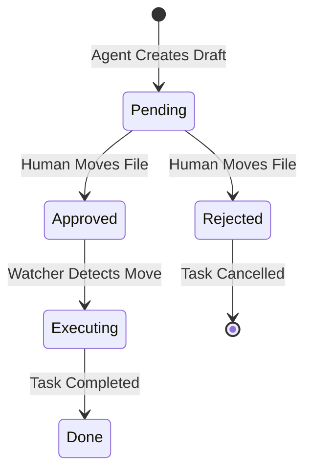

# Silver Tier: The Assistant
> **Communication & Approval.**

This module adds external senses (Gmail, WhatsApp) and the critical Human-in-the-Loop safety valve.

## 🔐 OAuth2 Authentication Flow (Gmail)



## ✋ Human-in-the-Loop State Machine



## Components
*   **`gmail.py`**: OAuth2 Polling engine.
*   **`whatsapp.py`**: Headless browser sentinel.
*   **`approval.py`**: State machine for manual sign-off.

## Running Tests
```bash
uv run pytest tier_2_silver/tests
```